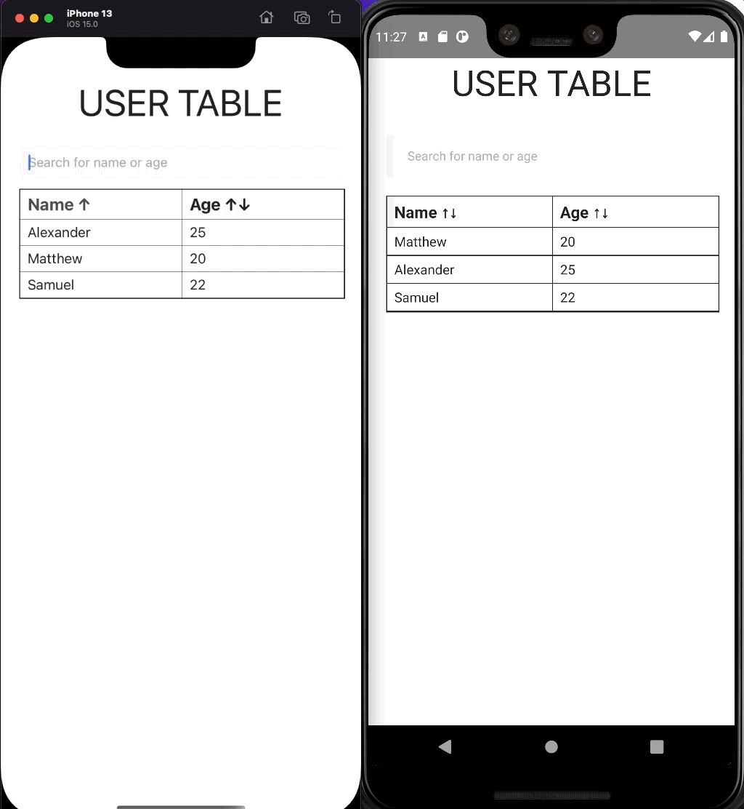
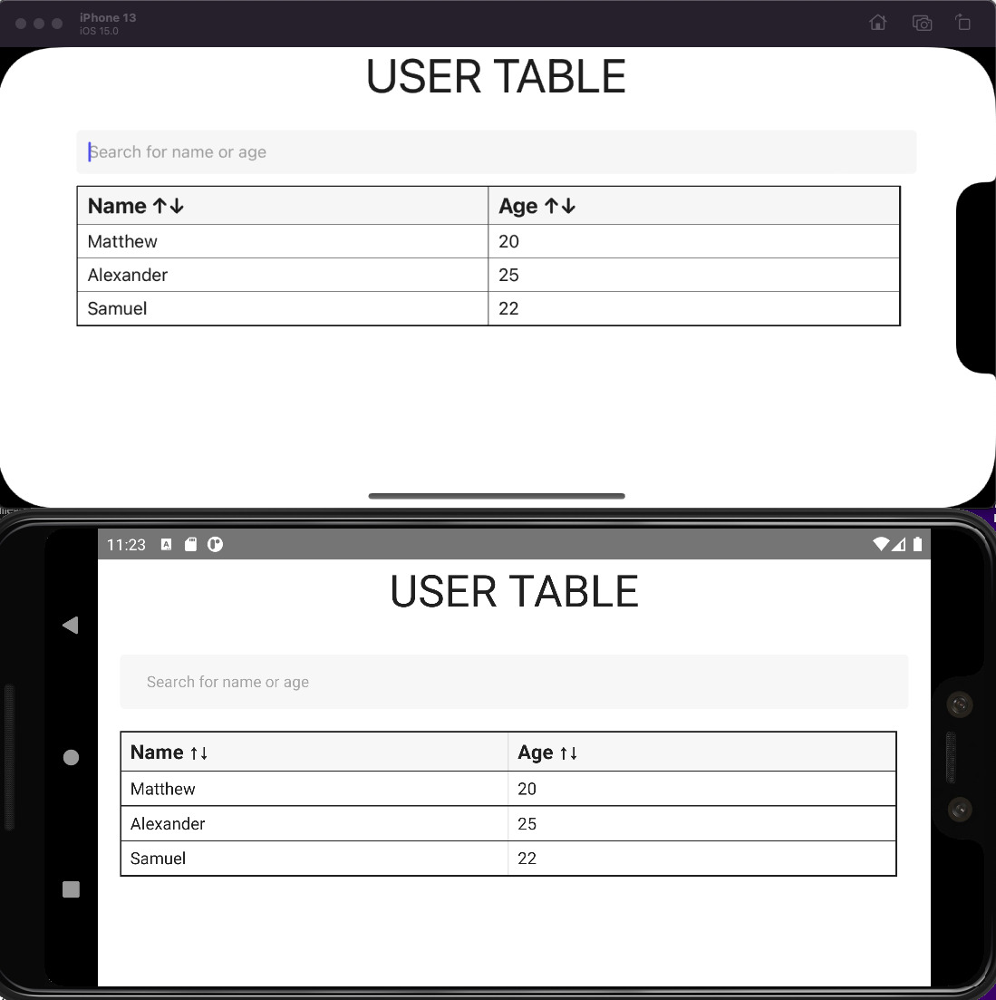
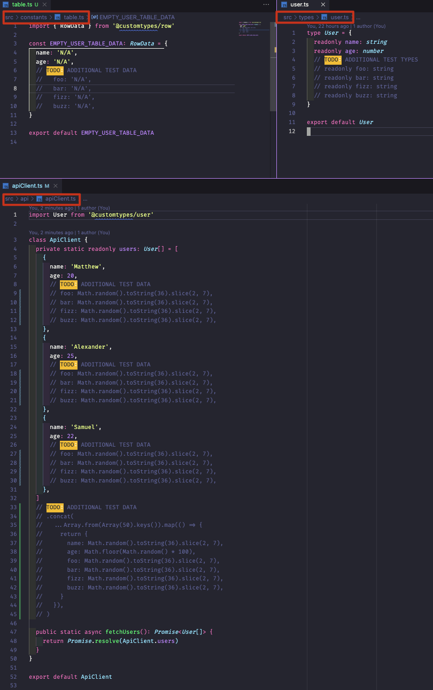

# search-sort-table-view
> Generated using [ramirezjag00/react-native-ts-template](https://github.com/ramirezjag00/react-native-ts-template)

## To run
```sh
cd [projectName]
npx husky install # do this once git init is done. this will automatically be called on succeeding `npm i`
# edit alias in babel.config.js according to folder structure/names
# edit paths in tsconfig.json according to folder structure/names
npm i # or npm i --legacy-peer-deps or npm i --force

### POD INSTALL
# for mac m1 users
# sudo arch -x86_64 gem install ffi
# cd ios && rm -rf Pods Podfile.lock && arch -x86_64 pod install && cd ..

# or for non-m1/m2 mac users
# cd ios && rm -rf Pods Podfile.lock && pod install && cd ..

npm run [ios/android]
```
---
<details>
<summary>rbenv && fastlane setup and usage</summary>

## rbenv: installing the right version of ruby
```sh
# install rbenv
brew install rbenv

# install ruby version from gemfile e.g. 2.7.5
rbenv install 2.7.5

# in .bash_profile or .zshrc add:
export PATH="$HOME/.rbenv/shims:$PATH"
eval "$(rbenv init -)"

# in terminal, to set a default version of ruby
rbenv global 2.7.5
rbenv local 2.7.5
rbenv rehash
# restart terminal
ruby -v # should output that version
```
## fastlane
```sh
# to get started
# check usertable/fastlane/Fastfile for fastlane actions and comments in it

### FASTLANE
# install dependencies of gemfile
bundle install

# to make sure all plugins are updated to the latest version, run in your project
bundle exec fastlane update_plugins

# to run a fastlane action: check usertable/fastlane/README.md for actions e.g.
bundle exec fastlane android build_qa

# to update fastlane
bundle update fastlane

# for "fastlane x github actions" add the following sample of fastlane actions as jobs: -> steps: in .github/workflow/main.yml

# Runs bundle install
- name: Run bundle install
  run: bundle install

# Runs a fastlane - qa build
- name: Run fastlane - android qa build
  run: bundle exec fastlane android build_qa

# Runs a fastlane - tg notification of a build
- name: Run fastlane - telegram notification and upload apk of a build
  run: bundle exec fastlane notify_upload_to_telegram

# Runs a fastlane - slack notification  and upload of a build
- name: Run fastlane - slack notification and upload apk of a build
  run: bundle exec fastlane notify_upload_to_slack
```
</details>

---

<details>
  <summary>Initial Folder Structure</summary>

  ```
  🗂 src
  ├── 📁 assets  
  │   ├── 📁 images 
  │   └── 📁 fonts
  │
  ├── 📁 components  
  │   ├── 📁 common 
  │   │   └── 📄 Button.tsx 
  │   │
  │   └── 📁 screens
  │       ├── 📁 Tab1
  │       │    ├── 📁 ScreenA 
  │       │    │   ├── 📁 components
  │       │    │   └── 📄 ScreenA.tsx
  │       │    │ 
  │       │    └── 📁 ScreenB 
  │       │
  │       └── 📁 Tab2
  ├── 📁 constants 
  ├── 📁 redux
  │    ├── 📁 apis (createApis)
  │    ├── 📁 slices (createSlices)
  │    └── 📄 store.ts 
  ├── 📁 routes
  │    ├── 📄 BottomTabStack.tsx 
  │    ├── 📄 RootStack.tsx 
  │    ├── 📄 FirstStack.tsx 
  │    ├── 📄 SecondStack.tsx 
  │    └── 📄 PreAuthStack.tsx 
  ├── 📁 types
  │    ├── 📁 navigation
  │    └── 📄 preauth.ts 
  │
  └── 📁 utils
      └── 📁 hooks
  ```
</details>

---

## APK [HERE](https://drive.google.com/file/d/1gkE72g7lc0RoNXYLEFSNe2JYXNTmdjdr/view?usp=sharing)

### PORTRAIT GIF


### LANDSCAPE PNG


### Tech Stack
- React Native
- Typescript
- Lodash
  - debounce
  - orderby
- AsyncStorage
- dates
  - dayjs
  - mockdate 3.0.5
- testing
  - jest v28.1.3
  - react-test-renderer v18
  - @testing-library/react-native v11

### Tasks
- [x]  As a user I should be able to see users data in a table format using the given mock data
    - [x]  create a table-list list (looks like an excel sheet)
- [x]  As a user I should be able to search users table
    - [x]  add debouncing mechanism for the search
- [x]  As a user I should be able to sort users table by name or age
    - [x]  should be future proof to have it work with any generic array of data (see Test Data Section)
- [x]  As a user I should be able update the table with pull-to-refresh
- [x]  As a user I should be able to see previously fetched/cached data
    - [x]  store data in Async Storage
    - [x]  cache first and only fetch data once per hour
        - [x]  fetch data again if cache is empty
    - [x]  write a few tests to make sure your caching mechanism works as intended


---

<details>
<summary>Why? 🤔</summary>

- Day 1
  - Tables can be done with native table/grid in ios/android or there are libraries for generating tables like the ff but these libs requires you to reshape your data to arrays of column values in a table:
    - GeekyAnts / react-native-easy-grid
    - Gil2015 / react-native-table-component
    - callstack/react-native-paper
  - But I like making my own tools so, I made these components and features with just a few dependencies like lodash (debounce & orderby) and will work on any data w/o reshaping
  - Initially, I went with ScrollView and .map for horizontal/vertical scrolling of the table but I was thinking of the performance eventually, so I tried @shopify/flash-list. While that worked on my demo project for a section-list, it lacks a lot of props I need for a Table. Lastly, I migrated everything to the same old FlatList. Those 3 experiments took some time to implement, especially bec. I need the Cell Component to calculate itself to maximize the screen depending on the orientation of the device. 😂
- Day 2
  - For the search and sort, while there's Fuse.js or just using ReduxToolKit, will make these features easier. I tried using asyncFilter and lodash's orderby and debounce -- it worked well even after adding new key-value pairs for the test data but performance can still be improved (see Issues Tab of repo)
- Day 3
  - Caching and fetching conditions could've been faster to build and much organized with Redux-ToolKit, RTK-Query and a faster storage like MMKV, but still, I was able to pull it off (hooks + Async Storage + dayjs) and add in another Table feature which is pull to refresh
- Day 4
  - Since async storage supports tests with jest and with the help of dayjs + mockdate + RNTL's renderhook, writing tests for the caching mechanism was straightforward. I guess the only challenge here was with the act errors, where you need to read the new jest.useFakeTimers in jest v11 (set up in jest in package.json to use it globally and legacy) and understand how await waitFor(() => ...) works.
</details>

---

### How to add test data? 🧐
- Uncomment lines after TODO in the files from the image
- Table, Row, Cell Components and search & sorting will still work even after adding key-value pairs
- Try rotating device to portrait/landscape
 
